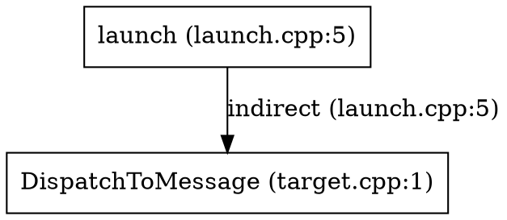
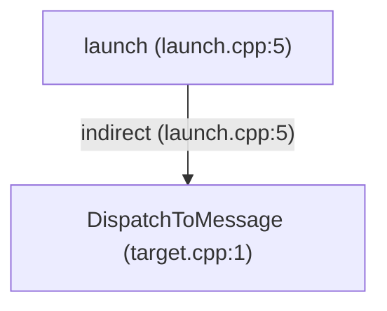

# trace

**trace** is a static analysis tool for C codebases. It runs a custom preprocessor, parses translation units with [tree-sitter](https://tree-sitter.github.io/), performs Andersen-style field-sensitive pointer analysis, and exports call graphs and interprocedural argument-flow facts to SQLite.

Typical uses:

- Find **direct and indirect** call targets (function pointers, vtables, struct op tables).
- Trace **argument flow** from call-site actuals to callee formals.
- Query results with **`trace inspect`** or ad-hoc SQL.

## Build

```bash
cargo build --release
# binary: target/release/trace
```

Run the workspace test suite:

```bash
cargo test --workspace
```

## Quick start

```bash
trace analyze ./tests/fixtures/direct_call -o /tmp/trace.db
trace inspect /tmp/trace.db calls
trace inspect /tmp/trace.db calls --from main
trace inspect /tmp/trace.db calls --from caller --to helper
```

Analyze a large tree (parallel indexing, minimal SQLite export):

```bash
trace analyze /path/to/project -o /tmp/project.db --jobs 8
```

## CLI reference

### `trace analyze`

Analyze every C/C++ file (`.c`, `.cpp`, `.cc`, `.cxx`) under `TARGET` and write results to SQLite.

```text
trace analyze [OPTIONS] <TARGET>
```

| Option | Description |
|--------|-------------|
| `<TARGET>` | Root directory to scan recursively for `*.c` / `*.cpp` / `*.cc` / `*.cxx` files. |
| `-o`, `--output <PATH>` | Output database path. Default: `trace.db`. |
| `--include <PATH>` | Add a preprocessor `#include` search path. Repeatable. |
| `-D <NAME>` | Define preprocessor macro `NAME=1`. Repeatable. |
| `-D <NAME=VALUE>` | Define macro with explicit value. Repeatable. |
| `--jobs <N>` | Parallel jobs for indexing (parse + lower). Default: logical CPU count. |
| `--timeout-secs <N>` | Watchdog: abort the process after N seconds (exit 124). Useful when probing hang-prone trees. |
| `--full-export` | Export full IR detail: all types, all variables, PAG `locations`. Slower and produces a larger database. |
| `--debug-points-to` | Retain points-to sets during analysis and export the `points_to` debug table (requires PAG in memory). Implies keeping location data needed for export. |
| `--models <FILE>` | Load a TOML function-model file (interprocedural summaries for bodyless callees, e.g. `memcpy_s`). Repeatable; later files override earlier entries and built-ins. See `docs/ANALYSIS.md`. |
| `--no-ipc` | Disable IPC proxy→stub bridge edge detection (enabled by default). Bridge edges are synthetic (`resolution = 'ipc'`, `call_site_id = NULL`) and connect a `*Proxy*` method to its `*Stub*` handler across the opaque Binder boundary. See `docs/IPC_ROADMAP.md`. |

**Progress output** (stderr):

```text
discover: 618 TUs, 200 headers under /path
include-graph: 818 files, 1200 include edges
warm: 1/90 /path/foo.h
parse: 0 orphan headers, 618 TUs (jobs=8)
index: 24.2s (618 files, 11442 functions, 48406 flow)
analyze: 0.3s (25478 edges, 3468 indirect)
export: 0.1s
analysis complete: 11442 functions, 25478 call edges, 25803 arg-flow edges -> trace.db
```

**Examples**

```bash
# HDF-style tree with extra include roots
trace analyze ~/drivers_hdf_core -o /tmp/hdf.db \
  --include ~/drivers_hdf_core/framework/core/common/include \
  -D __LITEOS__ -D CONFIG_XXX=1

# Debug pointer analysis
trace analyze ./my_app -o /tmp/debug.db --debug-points-to --full-export
```

**Notes**

- **`.c` and `.cpp`-family files** are indexed as translation units. Headers are pulled in via `#include` during preprocessing, not analyzed as standalone TUs. C++ support is a pragmatic first step — see [docs/ANALYSIS.md](docs/ANALYSIS.md) for scope and imprecision.
- Line numbers in the database refer to **original** files on disk (resolved through the preprocessor's `LineMap`); call sites inside macro expansions attribute to the expansion site.
- Pass include paths that match your build; there is no `compile_commands.json` integration yet.
- **`static` functions** (internal linkage) and **file-scope `static` variables** are resolved within the defining translation unit. **`static` locals** inside functions are tracked as `fn_static` storage.

## `static` storage support

| Context | IR / export | Call / flow resolution |
|---------|-------------|------------------------|
| File-scope `static` function | `linkage = internal` | Direct calls and `CallReturn` via scope-aware name lookup (`file` + name) |
| File-scope `static` variable | `kind = file_static` | Persistent PAG location; name lookup scoped to file |
| Function-local `static` variable | `kind = fn_static` | Persistent PAG location within enclosing function |
| External (non-`static`) symbols | `linkage = external` | Global `fn_by_name` / `global_by_name` tables |

Same identifier in different `.c` files (each `static`) gets distinct IR ids; resolution uses the call site's file.

### `trace inspect`

Query an existing analysis database.

```text
trace inspect <DB> calls [--from FN] [--to FN] [--file SUBSTR]

Edges print as `caller (file:line) -> callee [deffile] (resolution)` — the
`[deffile]` bracket distinguishes same-name (e.g. `static`) functions defined
in different files; `--file` filters edges whose caller or callee file path
contains the substring.
```

| Option | Description |
|--------|-------------|
| `<DB>` | Path to SQLite file produced by `trace analyze`. |
| `--from <FN>` | Filter edges where the **caller** name equals `FN` or ends with `::FN` (C++ qualified methods). `_` and `%` in `FN` are literal, not `LIKE` wildcards. |
| `--to <FN>` | Filter edges where the **callee** name equals `FN` or ends with `::FN`. Same escaping as `--from`. |

Both filters may be combined. Output format:

```text
CallerFn -> CalleeFn (direct|indirect|ambiguous) at line N
```

Only **`call_edges`** are listed. Unresolved indirect call sites appear in `call_sites` but produce no line here unless an edge exists.

**Examples**

```bash
trace inspect /tmp/hdf.db calls --from NetIfSetAddr
trace inspect /tmp/hdf.db calls --from HdfSbufReadBuffer
trace inspect /tmp/hdf.db calls --to LiteNetSetIpAddr
```

For unresolved indirect calls, query SQL directly (see below).

### `trace inspect callgraph`

Print the transitive callees or callers of the function containing a line.

```text
trace inspect <DB> callgraph --file SUBSTR --line N [--depth N] [--direction down|up]
```

| Option | Description |
|--------|-------------|
| `--file <SUBSTR>` | File path substring to disambiguate same-name functions. |
| `--line <N>` | A line inside the function of interest. |
| `--depth <N>` | Maximum BFS depth (default 3). |
| `--direction` | `down` = callees (default), `up` = callers. |
| `--format` | Output format: `text` (default), `json`, `graphviz`, or `mermaid`. |

The start function is chosen among definitions whose `[line_start, line_end]`
contains `--line`. Edges are labeled with their resolution (`direct`,
`indirect`, `external`, `ambiguous`) and call-site locations; repeated
callees print `(see above; also file:line)`.

**Examples**

```bash
trace inspect /tmp/hdf.db callgraph --file devsvc_manager.c --line 120 --depth 2
trace inspect /tmp/hdf.db callgraph --file hdf_service_record.c --line 20 --direction up
```

### `trace inspect dataflow`

Walk the PAG value-flow graph from a variable declaration.

```text
trace inspect <DB> dataflow --file SUBSTR --line N --col C [--depth N] [--direction down|up]
```

| Option | Description |
|--------|-------------|
| `--file <SUBSTR>` | File path substring. |
| `--line <N>`, `--col <C>` | Position near a variable **declaration** (use sites are not recorded). |
| `--depth <N>` | Maximum BFS depth (default 3). |
| `--direction` | `down` = where the value flows (default), `up` = where it came from. |
| `--format` | Output format: `text` (default), `json`, `graphviz`, or `mermaid`. |

Edges show how values move: `copy`, `addr_of`, `load`, `store`, `gep`,
`points_to` (variable → storage), and `call_arg` (argument passing into a
callee formal). Function-pointer values appear as `fn:<name>` nodes.

The same C parameter may exist as several IR variables (one per TU that sees
its declaration). If nothing flows through the queried copy, the traversal
automatically widens to same-name parameters of the same function record
(after merge all copies share one function entry).

**Examples**

```bash
trace inspect /tmp/hdf.db dataflow --file can_test.c --line 33 --col 31
trace inspect /tmp/hdf.db dataflow --file usb_raw_io.c --line 331 --col 23 --depth 4
```

### Graph output formats

Both `callgraph` and `dataflow` accept `--format text|json|graphviz|mermaid`
(`text` is the default). `text` is the indented view shown above; the other
formats emit machine-readable graphs of the same traversal — same nodes,
same edges, same depth limit and truncation semantics. `trace inspect dataflow`
prints its candidate/fallback `note:` hints on stderr in every format.

All examples below run the same query on `/tmp/hpp.db`
(`tests/fixtures/hpp_designated_dispatch`):

```bash
trace inspect /tmp/hpp.db callgraph --file hpp_designated_dispatch/launch.cpp --line 5 --depth 3
```

**`--format text`** (default)

```text
callgraph from launch (launch.cpp:5-5) (callees, depth 3):
* launch (launch.cpp:5)
  -indirect-> DispatchToMessage (target.cpp:1) (launch.cpp:5)
2 functions, 1 edges
```

**`--format json`** — a single JSON document with `title`, `direction`,
`depth`, `truncated`, `summary`, `nodes`, and `edges`:

```json
{
  "title": "callgraph from launch (launch.cpp:5-5) (callees, depth 3):",
  "direction": "callees",
  "depth": 3,
  "truncated": false,
  "summary": "2 functions, 1 edges",
  "nodes": [
    {
      "id": 0,
      "depth": 0,
      "label": "launch (launch.cpp:5)",
      "detail": "launch.cpp:5"
    },
    {
      "id": 1,
      "depth": 1,
      "label": "DispatchToMessage (target.cpp:1)",
      "detail": "target.cpp:1"
    }
  ],
  "edges": [
    {
      "from": 0,
      "to": 1,
      "label": "indirect",
      "site": "launch.cpp:5"
    }
  ]
}
```

**`--format graphviz`** — a DOT `digraph` renderable with `dot`:

```bash
trace inspect /tmp/hpp.db callgraph --file hpp_designated_dispatch/launch.cpp --line 5 --depth 3 --format graphviz > call.dot
dot -Tsvg call.dot -o call.svg
```



**`--format mermaid`** — a Mermaid `flowchart` for GitHub/Markdown or
`mmdc`:

````markdown

````

The same flag applies to `dataflow`:

```text
trace inspect /tmp/hpp.db dataflow --file hpp_designated_dispatch/launch.cpp --line 5 --col 12 --format mermaid
```

Every format escapes special characters (quote/backslash for DOT, HTML
entities for Mermaid, JSON via `serde_json`), so arbitrary C++ names and
file paths stay valid input.

## Analysis pipeline

```
discover .c/.cpp → preprocess → parse → lower IR → build PAG → solve → export SQLite
```

| Stage | What happens |
|-------|----------------|
| **Index** | Discover `.c` / `.cpp` files, preprocess TUs (custom preprocessor), parse with tree-sitter (C or C++ grammar per TU), lower to IR (functions, variables, flow constraints, call sites). |
| **Analyze** | Build pointer assignment graph (PAG), run Andersen-style solver, resolve direct calls by name (including file-local `static` functions), indirect calls via points-to to function locations. |
| **Export** | Write SQLite (minimal by default). |

Analysis is **may-analysis** (sound over-approximation): if a call target is possible, it may appear as an edge.

## Export modes

| Mode | Flags | Database contents |
|------|-------|-------------------|
| **Minimal** (default) | *(none)* | `analysis_run`, `files`, `functions`, filtered `call_sites`, `call_edges`, `arg_flow_edges`, PAG-referenced variables, flow graph (`flow_nodes` / `flow_edges`), `diagnostics`. |
| **Full IR** | `--full-export` | Minimal plus all `types`, all `variables`, PAG `locations`. |
| **Points-to debug** | `--debug-points-to` | Adds `points_to` table (and retains PAG during analysis). Use with `--full-export` for complete debug dumps. |

The flow-graph tables are always exported because `trace inspect dataflow`
queries them directly.

### Call site export filter

`call_sites` rows are written when any of the following holds:

- The site has at least one **`call_edge`**.
- The site has at least one **`arg_flow_edge`**.
- The site is an **indirect** call (`is_direct = 0`), including unresolved function-pointer calls.

So unresolved indirect sites (e.g. `sbuf->impl->readBuffer` before a fix) still appear in `call_sites` even with zero `call_edges`.

## SQLite database schema

Schema version: **v1**. Foreign keys are declared in DDL; exports temporarily disable FK enforcement for bulk load speed.

### Entity relationship (overview)

```text
analysis_run
files ─┬─ functions ─┬─ call_sites ─┬─ call_edges → functions (callee)
       │             │              └─ arg_flow_edges → variables
       └─ variables ─ flow_nodes ─ flow_edges → flow_nodes
                    (fn_id → functions, type_id → types)
types
locations (full export / debug)
points_to (debug only)
diagnostics
```

### `analysis_run`

Metadata for one `trace analyze` invocation.

| Column | Type | Description |
|--------|------|-------------|
| `id` | INTEGER PK | Run id (always `1` per file). |
| `trace_version` | TEXT | trace crate version string. |
| `target_root` | TEXT | Absolute or normalized `<TARGET>` path. |
| `created_at` | TEXT | Unix timestamp (seconds). |
| `options_json` | TEXT | JSON: `include_paths`, `defines`, `include_points_to`, `full_detail`. |

### `files`

| Column | Type | Description |
|--------|------|-------------|
| `id` | INTEGER PK | Internal file id. |
| `path` | TEXT UNIQUE | Source file path. |
| `sha256` | TEXT | Content hash (may be empty in current export). |

### `functions`

| Column | Type | Description |
|--------|------|-------------|
| `id` | INTEGER PK | Internal function id. |
| `name` | TEXT | Linkage-visible name (may duplicate across TUs before merge; ids differ). |
| `file_id` | INTEGER FK → `files` | Defining or primary declaration file. |
| `line_start` | INTEGER | Start line (original file). |
| `line_end` | INTEGER | End line of the definition body; equals `line_start` for prototypes/synthesized externals. |
| `linkage` | TEXT | `external`, `internal`, or `none`. |
| `signature` | TEXT | Placeholder signature string (`fn_<name>`). |
| `is_defined` | INTEGER | 1 if a body exists under the analyzed root; 0 covers prototypes and synthesized externals (libc, macro-referenced logging backends). |

**Index:** `functions(name)`.

### `call_sites`

One row per collected call (direct name call or indirect/function-pointer syntax).

| Column | Type | Description |
|--------|------|-------------|
| `id` | INTEGER PK | Call site id (matches IR `CallSiteId`). |
| `caller_fn_id` | INTEGER FK → `functions` | Containing function. |
| `file_id` | INTEGER FK → `files` | File containing the call. |
| `line` | INTEGER | Line (original file). |
| `col` | INTEGER | Column. |
| `callee_text` | TEXT | Surface syntax, e.g. `foo`, `p->handler`, `ndImpl->interFace->setIpAddr`. |
| `is_direct` | INTEGER | `1` = direct call by name; `0` = indirect / fn-ptr / unresolved name. |

### `call_edges`

Resolved caller → callee edges (one row per target; indirect sites may have multiple rows).

| Column | Type | Description |
|--------|------|-------------|
| `id` | INTEGER PK | Edge id. |
| `call_site_id` | INTEGER FK → `call_sites` | Call site this edge resolves; `NULL` for synthetic IPC bridge edges. |
| `caller_fn_id` | INTEGER FK → `functions` | Resolved caller function. |
| `callee_fn_id` | INTEGER FK → `functions` | Resolved target function. |
| `resolution` | TEXT | `direct`, `indirect`, `ambiguous`, `external` (statically resolved but bodyless under the analyzed root), or `ipc` (synthetic proxy→stub bridge edge — no source call site, caller is the proxy method). |

**Indexes:** `call_edges(callee_fn_id)`, `call_edges(call_site_id)`.

### `arg_flow_edges`

Maps actual arguments at a call site to callee formal parameters (when wired by analysis). Each row has **either** a variable actual **or** a function-pointer actual.

| Column | Type | Description |
|--------|------|-------------|
| `id` | INTEGER PK | Edge id. |
| `call_site_id` | INTEGER FK → `call_sites` | Call site. |
| `arg_index` | INTEGER | Zero-based argument index. |
| `actual_var_id` | INTEGER FK → `variables` | Variable passed at call site (`NULL` when actual is a function). |
| `actual_fn_id` | INTEGER FK → `functions` | Function passed as fn-ptr actual (`NULL` when actual is a variable). |
| `formal_var_id` | INTEGER FK → `variables` | Callee parameter variable. |

**Index:** `arg_flow_edges(call_site_id)`.

### `variables`

Present in full export; in minimal export, only variables referenced by the
flow graph / arg-flow edges.

| Column | Type | Description |
|--------|------|-------------|
| `id` | INTEGER PK | Variable id. |
| `name` | TEXT | Source name or synthetic temp (`_gepN`, `_loadN`, …). |
| `kind` | TEXT | `global`, `file_static`, `fn_static`, `param`, `local`. |
| `fn_id` | INTEGER FK → `functions` | Enclosing function (`NULL` for globals). |
| `type_id` | INTEGER FK → `types` | Type id. |
| `file_id` | INTEGER FK → `files` | Declaration file. |
| `line` | INTEGER | Declaration line. |
| `col` | INTEGER | Declaration column (start of the declarator). |

### `flow_nodes`

PAG value-flow nodes used by `trace inspect dataflow`. Always exported.

| Column | Type | Description |
|--------|------|-------------|
| `id` | INTEGER PK | PAG node id (same id space as `points_to.var_node_id`). |
| `kind` | TEXT | `var`, `loc`, `call_target` (indirect-call site node), or `terminator` (function-model clears event). |
| `label` | TEXT | Variable name, `loc:…`, or `fn:…`. |
| `detail` | TEXT | Extra context (variable kind, enclosing function, …). |
| `var_id` | INTEGER FK → `variables` | Owning variable (`NULL` for function locations). |
| `fn_id` | INTEGER FK → `functions` | Enclosing function, when known. |

**Index:** `flow_nodes(var_id)`.

### `flow_edges`

Directed value-flow edges (value flows src → dst). Always exported.

| Column | Type | Description |
|--------|------|-------------|
| `id` | INTEGER PK | Edge id. |
| `src_node` | INTEGER FK → `flow_nodes` | Source node. |
| `dst_node` | INTEGER FK → `flow_nodes` | Destination node. |
| `kind` | TEXT | `copy`, `addr_of`, `load`, `store`, `gep`, `dlsym`, `points_to`, `call_arg`, or `terminates` (function-model clears event). |

**Indexes:** `flow_edges(src_node)`, `flow_edges(dst_node)`.

### `types`

Exported only with `--full-export`.

| Column | Type | Description |
|--------|------|-------------|
| `id` | INTEGER PK | Type id. |
| `kind` | TEXT | `void`, `int`, `struct`, `ptr`, `fn_ptr`, … |
| `name` | TEXT | Display name. |
| `size` | INTEGER | Layout size in bytes. |
| `layout_json` | TEXT | JSON field layout for structs/unions. |

### `locations`

PAG abstract memory locations. Exported with `--full-export`.

| Column | Type | Description |
|--------|------|-------------|
| `id` | INTEGER PK | Location id. |
| `kind` | TEXT | e.g. `global`, `local`, `field_summary`, `function`, `string_lit`. |
| `desc` | TEXT | Human-readable description. |
| `type_id` | INTEGER FK → `types` | Optional type. |

### `points_to`

Maps PAG variable nodes to abstract locations. Exported with `--debug-points-to`.

| Column | Type | Description |
|--------|------|-------------|
| `var_node_id` | INTEGER | PAG node id. |
| `loc_id` | INTEGER FK → `locations` | Points-to target. |

Primary key: `(var_node_id, loc_id)`.

### `diagnostics`

Preprocessor, parse, and analysis messages.

| Column | Type | Description |
|--------|------|-------------|
| `id` | INTEGER PK | Diagnostic id. |
| `severity` | TEXT | `error`, `warning`, `info`. |
| `file_id` | INTEGER FK → `files` | Optional file. |
| `line` | INTEGER | Line number. |
| `message` | TEXT | Message text. |
| `stage` | TEXT | `preprocess`, `parse`, or `analysis`. |

## Example SQL queries

### Callees of a function

```sql
SELECT callee.name, ce.resolution, cs.line, cs.callee_text
FROM call_edges ce
JOIN call_sites cs ON cs.id = ce.call_site_id
JOIN functions caller ON caller.id = cs.caller_fn_id
JOIN functions callee ON callee.id = ce.callee_fn_id
WHERE caller.name = 'HdfSbufReadBuffer';
```

### Unresolved indirect call sites

```sql
SELECT caller.name, cs.line, cs.callee_text
FROM call_sites cs
JOIN functions caller ON caller.id = cs.caller_fn_id
LEFT JOIN call_edges ce ON ce.call_site_id = cs.id
WHERE cs.is_direct = 0 AND ce.id IS NULL
ORDER BY caller.name, cs.line;
```

### All indirect resolutions for a call expression pattern

```sql
SELECT caller.name, callee.name, cs.line
FROM call_edges ce
JOIN call_sites cs ON cs.id = ce.call_site_id
JOIN functions caller ON caller.id = cs.caller_fn_id
JOIN functions callee ON callee.id = ce.callee_fn_id
WHERE ce.resolution = 'indirect'
  AND cs.callee_text LIKE '%readBuffer%';
```

### Callers of a function

```sql
SELECT caller.name, ce.resolution, cs.line
FROM call_edges ce
JOIN call_sites cs ON cs.id = ce.call_site_id
JOIN functions caller ON caller.id = cs.caller_fn_id
JOIN functions callee ON callee.id = ce.callee_fn_id
WHERE callee.name = 'LiteNetSetIpAddr';
```

### Argument flow at a call site (variable actuals)

```sql
SELECT cs.line, af.arg_index, av.name AS actual, fv.name AS formal
FROM arg_flow_edges af
JOIN call_sites cs ON cs.id = af.call_site_id
JOIN variables av ON av.id = af.actual_var_id
JOIN variables fv ON fv.id = af.formal_var_id
WHERE af.actual_var_id IS NOT NULL;
```

### Argument flow (function-pointer actuals)

```sql
SELECT cs.line, af.arg_index, f.name AS actual_fn, fv.name AS formal
FROM arg_flow_edges af
JOIN call_sites cs ON cs.id = af.call_site_id
JOIN functions f ON f.id = af.actual_fn_id
JOIN variables fv ON fv.id = af.formal_var_id
WHERE af.actual_fn_id IS NOT NULL;
```

## Project layout

```
crates/
  trace-preproc/   Custom C preprocessor (#include, #define, conditionals)
  trace-parse/     tree-sitter parsing, IR lowering, TU merge
  trace-ir/        Shared IR (types, symbols, flow constraints)
  trace-analysis/  PAG construction, Andersen solver, call graph
  trace-db/        SQLite schema and export
  trace-cli/       `trace` binary (`analyze`, `inspect`)
docs/              Design docs (architecture, analysis, preprocessor, schema)
tests/fixtures/    Integration test C corpora
```

## Limitations

- **C++ first step** — namespaces, overloads (arity), classes/virtual dispatch (including virtual bases), `final` class/method devirtualization, ctors/dtors, implicit `this->method()`, `shared_ptr`/`unique_ptr`/`weak_ptr` unwrap, and callables (`std::function`, lambdas, `operator()`) are modeled; type-based overload ranking and templates beyond name-stripping are not (see [docs/ANALYSIS.md](docs/ANALYSIS.md)). Next slices from hiview: [docs/CPP_ROADMAP.md](docs/CPP_ROADMAP.md).
- **May-analysis** — indirect calls can list multiple targets; absence of an edge does not prove unreachability.
- **No path sensitivity** — all branches and paths are merged.
- **Preprocessor subset** — not gcc/clang compatible for all extensions; see [docs/PREPROCESSOR.md](docs/PREPROCESSOR.md).
- **Include paths** — must be supplied manually via `--include` / `-D`; no `compile_commands.json` yet.
- **Line numbers** — refer to preprocessed TUs; map back to original sources manually when needed.

## Further reading

- [Architecture](docs/ARCHITECTURE.md)
- [Analysis algorithm](docs/ANALYSIS.md)
- [Preprocessor spec](docs/PREPROCESSOR.md)
- [SQLite schema (detailed)](docs/SQLITE_SCHEMA.md)
- [Roadmap](docs/ROADMAP.md)
- [C++ next slices (hiview)](docs/CPP_ROADMAP.md)
- [Contributor / agent guide](AGENTS.md)

## License

MIT
