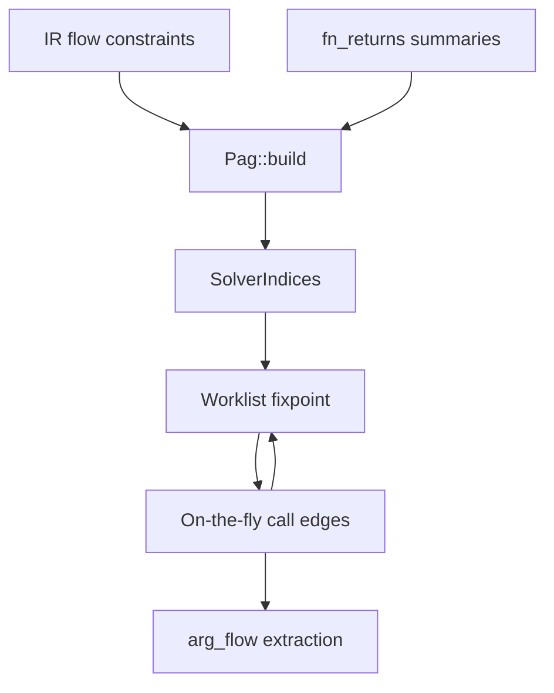

# Pointer analysis

trace uses inclusion-based (Andersen-style) pointer analysis to resolve indirect calls and wire interprocedural argument flow.

## Properties

| Property | Value |
|----------|-------|
| Scope | Whole-program (all indexed `.c` TUs under target root) |
| Flow sensitivity | **None** (control-flow insensitive) |
| Field handling | Field-sensitive with **instance-insensitive field summaries** |
| Pointer analysis kind | **May-analysis** (sound over-approximation) |
| Context sensitivity | **None** |

## Workflow



1. **`Pag::build(program)`** — materialize PAG nodes/constraints from `program.flow`, expand `CallReturn` using `program.fn_returns`, attach indirect-call `Load`/`Copy` constraints.
2. **`solve`** — worklist propagation until fixpoint; discover indirect callees when call-target points-to gains function locations.
3. **`extract_arg_flow`** — emit `arg_flow_edges` for wired parameter copies at resolved calls.

## IR flow constraints (`trace-ir`)

Lowered from C during parse. Mapped to PAG in `Pag::build_flow_constraints`.

| Constraint | Meaning | C example |
|------------|---------|-----------|
| `Copy { dst, src }` | pointer assignment | `p = q` |
| `AddrOfVar { dst, src }` | address of variable | `p = &x` |
| `AddrOfFn { dst, callee }` | address of function | `p = handler` (fn ptr) |
| `Load { dst, src }` | load through pointer | `y = *p` |
| `Store { dst, src }` | store through pointer | `*p = y`, `field = val` |
| `GepField { dst, base, field }` | field address | `&obj.field`, `p->field` |
| `ArrayFnMember { array, callee }` | fn-ptr array init member | `{ fn0, fn1 }` |
| `CallReturn { dst, callee_name }` | `dst = callee()` | `p = GetOps()` |

### Return-value flow

Functions record abstract return values in `program.fn_returns`:

| `ReturnFlow` | Source |
|--------------|--------|
| `AddrOfVar { src }` | `return &global` / `return &file_static` |
| `AddrOfFn { callee }` | `return &Fn` / fn identifier in `&` expression |
| `Copy { src }` | `return local` or `return param` |
| `Call { callee_name }` | `return Other()` (transitive; `Other` resolved in callee's file) |

`return &local` is recorded as `AddrOfVar` but is **unsound** for stack locals (may-analysis may report escaped addresses). Prefer treating this as a known imprecision.

At PAG build time, `CallReturn` resolves `callee_name` with **`resolve_function_candidates(name, file)`** — every function the merged name may refer to: the query file's internal-linkage entries (`fn_by_scope`, declarations included) plus the canonical external definition. Name-based facts lose the calling TU's visibility context at merge time, so a name matching both a file-`static` def and an external def is genuinely ambiguous; per may-analysis semantics all candidates are expanded. Callee ids that survived lowering + merge (e.g. `AddrOfFn`) are used directly instead — they are exact.

This models patterns like:

```c
subDev->subDevOps = GetSensorDeviceOps();  // return &g_sensorDeviceOps
subDev.subDevOps->setConfig(subDev);
```

## Program Assignment Graph (PAG)

### Node kinds

| `PagNodeKind` | Role |
|---------------|------|
| `Var(VarId)` | IR variable (local, param, global, synthetic temps) |
| `Loc(LocId)` | Abstract memory / function location |
| `CallTarget(CallSiteId)` | Synthetic node for indirect call resolution |

### PAG constraint kinds

| Kind | Semantics |
|------|-----------|
| `Copy` | `pts(dst) ⊇ pts(src)` |
| `AddrOf` | `pts(dst) ⊇ { loc }` |
| `Load` | for each `o ∈ pts(src)`: merge `memory_pts(o)` into `pts(dst)`; function locs copied directly |
| `Store` | for each `o ∈ pts(dst)`: merge `pts(src)` into `memory_pts(o)` and field summaries |
| `Gep` | field projection from base object locations (+ summary fallback) |

### Abstract location kinds

| `LocKind` | Description |
|-----------|-------------|
| `Global` | External/global variable |
| `FileStatic` | File-scope `static` |
| `FnStatic` | Function-local `static` |
| `Local` | Parameter or stack local storage |
| `Heap` | Reserved for allocator summaries (stub) |
| `Field` | Specific field at a known parent object location |
| `FieldSummary` | Instance-insensitive merge of struct field `T.f` across all instances |
| `ArraySummary` | Unknown-index array element summary |
| `Function` | Function entry address for indirect call targets |

### Lazy locations

**Global**, **file-scope `static`**, and **function-local `static`** variables receive `Loc` nodes eagerly at PAG build. Ordinary **locals** and **parameters** get locations **on demand** when referenced by `AddrOf`/`ensure_var_loc`.

## Solver

Worklist algorithm with **constraint adjacency index** (`SolverIndices`) for O(1) lookup of affected constraints per node.

### Work budget

Solving is capped at a deterministic **200 000 pops** by default. Normal corpora converge far below the cap (the HDF framework corpus needs ~42k). The cap trades late-stage target recall for bounded runtime: on the HDF whole tree, fn-pointer-deref site coverage completes around ~300k pops, and past that returns collapse sharply (+110s for +21% indirect edges from 300k→500k; +176s for +4% more from 500k→700k). Raise `TRACE_SOLVE_BUDGET_POPS` when maximal target recall on very large trees matters more than runtime; `=0` restores unlimited solving. The budget is deterministic, so repeated runs produce identical databases.

### State

| Map | Role |
|-----|------|
| `pts` | PAG node → set of abstract locations |
| `memory_pts` | Object location → set of stored pointer values |
| `loc_nodes` | Reverse index: location → PAG nodes that must be requeued on store |

### Propagation highlights

**`Gep` with empty base points-to**

When `pts(base)` is empty (typical for pointer parameters with no incoming flow), fall back to **`FieldSummary`** for `(struct_type(base), field)` via `ensure_field_summary_for_var`. This connects field stores through parameters to later field loads on unrelated instances (may-analysis).

**Stores to field summaries**

`apply_store` propagates into both concrete field locs and their `FieldSummary`, keeping summary memory in sync with instance stores.

**Signature-guarded function-value propagation**

Wrong-type pointer casts put unrelated objects into a pointer's points-to; a store through such a pointer would otherwise write callback addresses into alien layouts, where later field loads surface them as bogus indirect-call targets. The solver therefore filters **function values only** (all non-function flow stays unfiltered, preserving soundness):

- A fn value may enter `memory_pts[cell]` / a summary cell only when the cell's declared type accepts it: `FnPtr` slots require the same parameter count; concrete non-fn-pointer cells (`struct`, array, scalar-pointer, union) reject all fn values; unknown/untyped cells stay writable.
- The same guard applies when `merge_memory_into` lifts cell contents into points-to sets, and when a `Gep` passes fn values from the base node's set into the field node — except registered `array_fn_members` table members, which always pass (see "Arrays and function-pointer tables").

Consequence: callbacks stored through correctly-typed ops assignments resolve exactly as before, while cross-signature leaks (e.g. a 2-param `AddService` callback surfacing at 4-param `Dispatch` sites) are cut. Documented imprecision: old-style casts that stash fn pointers in `void *`-typed cells then call them through typed loads still work (unknown cells accept everything), but calls through cells whose declared type is structurally wrong for the stored fn are no longer reported.

**Indirect calls**

1. Each indirect call site gets a `CallTarget` node.
2. For field-path callees (`p->ops->fn`), lowering emits `Load`/`Copy` chain into a temp var; PAG connects `CallTarget` via `Copy` or `Load`.
3. When `pts(CallTarget)` gains a `Function` location, emit `CallGraphEdge` (resolution `indirect`), wire parameter `Copy` constraints, call `apply_call_summary`.

**Direct calls**

Sites lowering marked `is_direct = true` saw the TU-local binding, so scope-first **`resolve_function_in_scope(callee_name, call_site.file)`** is exact per C visibility rules: a file-`static` definition shadows same-name external functions inside its own TU (backed by the `fn_by_scope` index, which includes internal *declarations* — lowering streams a file top-down and initializers like `.Read = StaticFn` must bind before the definition is lowered).

Because header-defined functions are deduplicated to their header origin at merge time, `fn_by_scope` entries for them live under the header's `FileId`. Scope resolution therefore also consults **`headers_of(file)`** — the set of headers that contributed entities to a TU — so an includer still sees the header's internal-linkage definitions; TU-local definitions keep precedence on name collision.

**Cross-TU direct-call recovery**

A plain call whose definition lives in another TU is lowered with `is_direct = false` (the callee symbol is not visible in the calling TU). At solve time, sites that are *not* direct, have no `callee_var`, and whose callee text is a bare identifier are recovered as direct-by-name calls via `direct_by_name`, expanding **all** `resolve_function_candidates` (may-approximation — see `CallReturn` above). Without this, every cross-TU call to a function declared through a pointer-returning prototype (e.g. `T *f(void);`) would be dropped, because such prototypes previously also produced phantom variables — lowering now registers functions for pointer-wrapped declarators instead.

### Analyze options

```rust
pub struct AnalyzeOptions {
    pub retain_points_to: bool,  // CLI: --debug-points-to
}
```

When `retain_points_to` is false (default), points-to sets are discarded after solving to reduce memory.

## Field sensitivity

- Struct fields have distinct `FieldId` entries in `TypeTable`.
- `GepField` in IR becomes PAG `Gep` with field id.
- **`FieldSummary`** locations unify all instances of `struct T.field` for sound may-analysis (e.g. vtable writes through a parameter pointer visible at unrelated call sites).
- Unknown or non-struct base → GEP may no-op.

## Arrays and function-pointer tables

- **Constant index**: treated conservatively (element refinement is future work).
- **Unknown subscript**: `ArraySummary` — all elements merged.
- **`ArrayFnMember`**: each initializer function is merged into the array var's points-to; any subscript call may target **any** listed function.
- **Nested initializer lists** (`{ {TYPE, Fn}, ... }`): element expressions are visited recursively, so arrays of structs with fn-ptr members feed `ArrayFnMember` facts into the table var. Element fn values flow through field loads on the array itself *and* through pointers to elements (`m = &arr[i]; m->fn()`), regardless of worklist order.
- **Field-designated members** (`[i] = { .fn = Fn }`): lowered as precise
  `GepField`+`Store` chains against the array var (index-insensitive, like
  runtime element stores), so a member only feeds loads of the field it was
  written to. Purely positional nested lists still use the merged
  `ArrayFnMember` blob. Mixed forms where positional and designated members
  coexist in one element list keep the designated precision; bare positional
  members of such lists are not separately parked (rare; sound direction).
- **Initializer-less array declarations** (tentative definitions such as
  `static struct Ops g_tbl[4];`) register the variable like any other global;
  runtime stores into elements then resolve normally.
- **Positional struct initializers** (`static struct Ops o = { Fn, ... };`):
  each bare value is mapped to its declared field by position and lowered as
  the same precise `GepField`+`Store` chain designated members use — function
  addresses included. Position counting treats designated and bare members
  uniformly (C's reset-after-designator subtlety is not modeled; rare).

## Member subobject addressing

`&outer.member` lowers to a gep-temp chain targeting the member's own abstract
location, typed by the member's declared struct — not to a flattened address of
the outer instance. Field loads through such pointers resolve fields against
the member's type (`dev->service = &inst.service; ... service->Dispatch`
resolves `Dispatch`, not same-index members of the outer struct). Arrays of
structs peel to their element type for field resolution (`arr[i].field`).

## Indirect call resolution patterns

Supported lowering patterns include:

| Pattern | Example |
|---------|---------|
| Direct fn ptr var | `fp()` |
| Single field | `obj.handler()` |
| Multi-hop field | `p->ops->setIpAddr()` |
| Mixed `.` / `->` | `subDev.subDevOps->setConfig()` |
| Designated init | `.handler = &Fn` |

### External callees

Plain-identifier calls that resolve to no definition under the analyzed root
are classified as `external`, not left as unresolved indirect sites. Two
sources feed this class: prototype-only declarations (the callee resolves
statically but has no body here), and synthesized entries for names that are
never declared in the tree at all (libc without tree headers, logging
backends referenced only inside macros — `finalize_extern_callees`). Edges to
bodyless functions never carry param wiring unless the prototype declares
formals; unresolved fn-pointer sites (`ptr_expr` shapes) remain the only
occupants of the "no target" indirect bucket.
| Static ops struct | `g_ops = { .fn = Fn }` + `memcpy`-style assign via `SbufInterfaceAssign` (field store from global init) |
| Call return | `p->field = Getter()` |

## Argument flow

When a call edge is created (direct or indirect), actuals are connected to callee formals:

- **Pointer variables** → PAG `Copy` from actual var node to formal var node
- **Function identifiers** passed as fn-ptr args → `add_pts(formal, fn_loc)`

After fixpoint, `extract_arg_flow` records:

```
(call_site, arg_index, actual_var?, actual_fn?, formal_var)
```

Exactly one of `actual_var` or `actual_fn` is set per row. Only arguments that resolve to IR variables or function refs at the call site participate.

Return-value flow affects **points-to** (what a call expression assigns), not arg-flow formals.

## Libc / external summaries

Registered in `trace-analysis/src/summaries.rs` (`apply_call_summary`). Current stubs:

| Function | Model |
|----------|-------|
| `malloc`, `calloc`, `realloc` | No heap loc allocated yet (stub) |
| `free` | No effect |
| `memcpy`, `memmove` | **No pointer flow** |
| Others | No effect |

## C++ support (first step)

`.cpp/.cc/.cxx/C++` files are indexed as TUs and parsed with tree-sitter-cpp
(`SourceLang` per TU; headers inherit the including TU's grammar). Lowering is
C++-aware only where it must be — everything else reuses the C machinery.

- **Namespaces**: `ns_stack` qualifies declarations (`ns::f`). Anonymous
  namespaces get internal linkage. `using` directives are recorded but not
  used for base-name qualification.
- **Overloads**: same-name entries are kept apart when arity differs
  (arity-gated merge in `add_function`; `externals_by_name` bucket). Calls
  resolve over the candidate set filtered by argument count; an empty
  arity-filtered set falls back to all candidates (varargs). Ties emit one
  direct site per candidate.
- **Classes**: layouts intern under the fully qualified tag
  (`gfx::Shape`). Inheritance facts (`Program.inheritance`) drive member
  resolution: a call walks upward to the nearest declaring base. **Non-virtual**
  methods resolve exactly to that declaring function; **`virtual` methods and
  destructors** additionally expand downward through the subclass closure
  (one site per target — delete-through-base is the dominant dtor pattern).
  When no ancestor declares the member, the call falls back to the receiver's
  static-type subclass closure (receiver types can be imprecise).
- **Methods**: out-of-class definitions (`Ret Cls::m()`) merge with their
  in-class prototypes. An implicit `this` parameter (`Ptr(Struct{Cls})`,
  param index 0) is prepended. `virtual` flags survive merges.
- **Ctors / dtors**: emitted for `new Cls(...)`, destructor calls on
  `delete p`, explicit qualified dtor calls, constructor-declarations with
  an argument list, ctor-initializer lists (base + member targets).
- **References** lower as pointers (aliasing stores land on caller memory).
- **Templates**: lowered once per primary name; `<...>` arguments stripped.

Known C++ imprecision (in addition to the general list below):

- Implicit `this->member` accesses (bare identifiers inside methods) are
  **not** modeled; only explicit member access chains are.
- Default construction without parens (`Cls o;`) emits no ctor site.
- Objects at namespace scope emit no ctor/dtor sites (no enclosing function).
- Anonymous-namespace overload ties degrade to first-wins.
- Overload resolution is arity-only (no type-based ranking, conversions).
- Template specializations collapse into the primary entry; no
  dependent-type modeling.
- Virtual expansion assumes single inheritance for the upward walk
  (multiple bases still resolve, nearest declarer wins).
- Headers shared between `.c` and `.cpp` TUs parse under whichever
  grammar reaches them first at merge time.

## Known imprecision

- All paths merged; no null-check refinement.
- `free` does not invalidate pointers.
- `FieldSummary` may connect unrelated struct instances.
- Multiple vtable/ops targets reported for one indirect site (may-analysis).
- **Casts of struct instances to another ops type** (`svc = (IOps *)&inst`):
  the whole instance flows into the target-typed slot, so field loads on it
  resolve against the *outer* layout plus its type-matched summary — sibling
  fields at colliding positional indexes can cross into such loads (observed
  as ~2% of Dispatch-site edges on HDF test drivers).
- **Signature-guarded propagation drops cross-signature fn values** (see
  "Signature-guarded function-value propagation"): calls through cells whose
  declared fn-pointer arity mismatches the stored function are not reported.
  Sites whose only reachable "targets" arrived via such wrong-type flow now
  report none (e.g. stub-side `super->X` calls behind the unmodeled IPC
  boundary in HDF — their baseline targets were cross-object pollution, not
  real resolutions).
- **IPC / process boundaries are unmodeled**: `HdfRemoteServiceObtain`-style
  registrations that hand a dispatcher to an external broker do not connect
  client proxies to server-side handler objects.
- **`memcpy` / `memmove`**: invisible to analysis.
- Macro-generated identifiers may be skipped when classified as macro-like callees.
- Function pointer resolution is name/linkage based; dynamic `dlsym` not modeled.

## Performance notes

Whole-program HDF-scale runs (~600 TUs, ~11k functions) target roughly:

| Phase | Typical |
|-------|---------|
| Index | ~25s (parallel preprocess + parse) |
| Analyze | ~0.3s |
| Export (minimal) | ~0.1s |

Key optimizations: solver adjacency index, `loc_nodes` reverse index, worklist dedup, lazy abstract locations, minimal SQLite export, skipped redundant header indexing.
