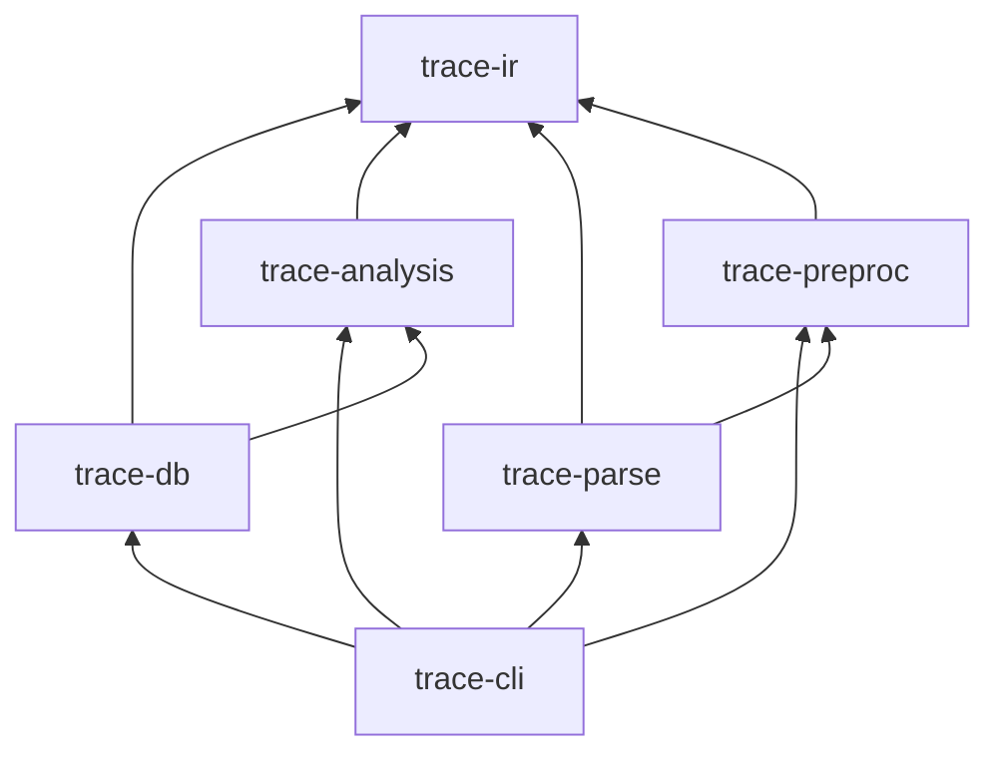

# Architecture

## Overview

trace analyzes a directory of C/C++ translation units (`.c` / `.cpp` files), builds a merged whole-program IR, runs Andersen-style pointer analysis, and exports call graphs and argument-flow edges to SQLite.

The pipeline is **strictly phased**: each stage has a narrow input/output contract and can be tested independently.

## End-to-end pipeline

### Stage summary

| Stage | Crate | Input | Output |
|-------|-------|-------|--------|
| Discover | `trace-parse` | Root directory | Lists of `.c`/`.cpp` and header paths |
| Include graph | `trace-parse` | File lists | `IncludeGraph` (deps, include dirs, preprocess set) |
| Preprocess | `trace-preproc` | Source file + options | Expanded source string + `LineMap` |
| Parse + lower | `trace-parse` | Preprocessed TU | `UnitIndex` (symbols, types, flow, call sites) |
| Merge | `trace-parse` | Per-TU indices | Single `Program` |
| Analyze | `trace-analysis` | `Program` | `Pag` + `AnalysisResult` |
| Export | `trace-db` | Program + analysis | SQLite v1 |

## Translation units and headers

- **Indexed TUs**: `*.c` and `*.cpp`-family files under `<TARGET>`. Each TU selects the tree-sitter C or C++ grammar by extension.
- **Headers**: discovered for the include graph but **not** lowered as standalone TUs. Their declarations appear in preprocessed `.c` output.
- **Orphan headers** (never `#include`d by any project `.c`) are skipped — they contribute no reachable code.
- **Cross-TU linking**: external symbols merged by name in `merge_unit_index` (`fn_by_name`). **`static` / internal-linkage** functions and file-scope `static` variables remain **per-file** and are resolved with `resolve_function_in_scope(name, file)` at analysis time.

## Crate dependencies

| Crate | Responsibility |
|-------|----------------|
| `trace-ir` | IDs, types, symbol table, `FlowConstraint`, `ReturnFlow`, `Program` |
| `trace-preproc` | Lexer, directives, macro expansion, `LineMap` |
| `trace-parse` | Discovery, include graph, tree-sitter parse, IR lowering, TU merge |
| `trace-analysis` | PAG build, Andersen solver, on-the-fly call graph, arg-flow extraction |
| `trace-db` | SQLite schema, minimal/full export |
| `trace-cli` | `analyze`, `inspect` |

## Program IR (`trace-ir`)

After merge, `Program` contains:

| Field | Description |
|-------|-------------|
| `symbols` | Files, functions, variables, call sites |
| `types` | Struct/union layouts, pointer types |
| `flow` | Lowered assignment facts (`Copy`, `Store`, `GepField`, …) |
| `fn_returns` | Per-function return-value summaries (`ReturnFlow`) |
| `diagnostics` | Parse/preprocess warnings |
| `include_deps` | `#include` edges for debugging |

Lowering (`trace-parse/src/lower.rs`) walks tree-sitter ASTs and emits **flow constraints** — not a full statement-level CFG.

## Analysis artifacts

| Artifact | Description |
|----------|-------------|
| `Pag` | Pointer assignment graph: nodes, constraints, abstract locations, solver adjacency index |
| `AnalysisResult.points_to` | Optional PAG-node → location sets (`--debug-points-to` only) |
| `AnalysisResult.call_edges` | Resolved direct + indirect call graph edges |
| `AnalysisResult.arg_flow_edges` | Actual → formal mapping per call site (`actual_var` or `actual_fn` + `formal`) |
| SQLite | Persisted subset of the above (see export modes below) |

## Export modes

| CLI flag | Effect |
|----------|--------|
| *(default)* | Minimal export: functions, filtered call sites, call edges, arg-flow, arg-flow variables only |
| `--full-export` | All types, all variables, PAG `locations` |
| `--debug-points-to` | Retain points-to in memory; export `points_to` table |

Indirect call sites **without** resolved edges are still exported in `call_sites` when `is_direct = 0`.

## Threading model

| Phase | Parallelism |
|-------|-------------|
| Preprocess cache | `--jobs N` (rayon), shared across TUs |
| Parse + lower | `--jobs N` per-TU indexing, deterministic merge order |
| Analysis + export | Single-threaded whole-program |

Default job count: logical CPU count.

## Source locations

Spans are resolved through the preprocessor `LineMap`: **all** entities use original file/line/column — code lowered from `#include`d files is attributed to the header it came from, and TU-local code keeps its original (pre-expansion) positions, so reported lines match the source in an editor. Code inside macro expansions attributes to the expansion site's origin. During merge, entities with the same origin (header file + name + line) are **deduplicated across translation units** — the first copy wins and later copies' references are redirected to it — so a header-defined function or its internal call sites appear once, attributed to the header, instead of once per including TU.

## Error handling

- Diagnostics collected per stage → `diagnostics` SQLite table.
- A failed TU is recorded; the run continues if other TUs succeed.
- Preprocessor errors on a TU may fall back to raw source read when expansion fails catastrophically.

## Extension points

| Change | Where |
|--------|-------|
| Preprocessor directive/macro | `trace-preproc` |
| New C construct / flow fact | `trace-parse/src/lower.rs`, `trace-ir/src/flow.rs` |
| New PAG constraint | `ConstraintKind` in `trace-analysis`, handler in `pag.rs` + `solver.rs` |
| Return / call semantics | `ReturnFlow`, `CallReturn`, `pag.expand_return_flows` |
| Libc summary | `trace-analysis/src/summaries.rs` |
| SQLite column/table | `trace-db/src/schema.rs`, `export.rs`, `docs/SQLITE_SCHEMA.md` |

See [ANALYSIS.md](ANALYSIS.md) for algorithm details and [AGENTS.md](../AGENTS.md) for contributor invariants.
